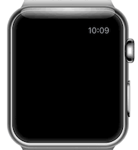
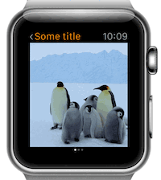

# WatchKit-Framer
Apple Watch Kit for FramerJS to help you easily create Apple Watch interfaces in Framer.

## Add it in your Framer Studio project

- Download the project from github.
- Copy `watchkit.coffee` into `modules/` folder.
- Import it in Framer Studio by writing: `WatchKit = require "watchkit"`.

**Note:** Components are prepared to be used with 42mm Apple Watch.  
**Note:** You need the San Francisco font [provided by Apple](https://developer.apple.com/watchkit/).

## Components

### Status Bar

Creates an Apple Watch status bar.


```coffeescript
statusBar = new WatchKit.StatusBar
	title: "Some title"
	back: true # Display or not the back button
	time: true # Display or not the time
```

### Buttons

Buttons should have the Y position where you want to place them in the screen.  
Buttons perform an animation when the user clicks them.

##### Button for actions


```coffeescript
actionButton = new WatchKit.ActionButton "Button title", y: 50
```

##### Button for dismiss


```coffeescript
dismissButton = new WatchKit.DismissButton y: 140
```

##### Button with image

Adds an image on the left side of the button.


```coffeescript
imageButton = new WatchKit.ActionButton image: "images/some-icon.jpg", y: 140
```

##### Disable a button

Buttons can be disabled using the `disabled: true`.


### Separator

Creates a default Apple separator. Specify the background color for a different color than the default one.


```coffeescript
separator = new WatchKit.Separator y: 100, backgroundColor: "blue"
```

### Notification

Creates a configurable notification.



```coffeescript
notification = new WatchKit.Notification
	title: "Alert title"
	appName: "App title"
	image: "image/some-image.jpg" # Set your app image
	contentBodyLayer: someLayerToUseAsBody

notification.show() # Show the notification
```

Additionally you can configure `appNameColor`, `contentBodyBackgroundColor` and `contentTitleBackgroundColor`.

##### Using text as body

`WatchKit.Notification.contentBodyFont` is exposed to be able to use the default font for the body content.

```coffeescript
contentBodyLayer = new Layer
	html: "Lorem ipsum dolor sit amet."
	style: _.extend {}, WatchKit.Notification.contentBodyFont,
		padding: "0 14px" # Set some padding for better display
		backgroundColor: "transparent"

notification = new WatchKit.Notification
	title: "Alert title"
	appName: "App title"
	contentBodyLayer: contentBodyLayer
	
notification.show()
```

##### Adding action buttons

By default there is only a dismiss button. You can add more buttons by using `addActionButton` or `addActionButtons` methods.

```coffeescript
actionButton1 = new WatchKit.ActionButton "Action 1"
actionButton2 = new WatchKit.ActionButton "Action 2"

notification = new WatchKit.Notification
	title: "Alert title"
	appName: "App title"
	
notification.addActionButtons actionButton1, actionButton2
	
notification.show()
```
	
### Pagination

Creates a framer page component with the apple watch pagination dots.  
Pagination contains a set of pages that can be swiped.



```coffeescript
pagination = new WatchKit.Pagination
	showPagination: true # Display or not the pagination dots
```

#### Page

The basic page for the pagination element.  

```coffeescript
page = new WatchKit.Page
```

Layers can be added inside a page by using the `addLayer` method.

```coffeescript
page = new WatchKit.Page
layer = new Layer

page.addLayer layer
```

In order to add pages to the pagination object, use the `addPage` or `addPages` method.

```coffeescript
page1 = new WatchKit.Page image: "images/some_image.jpg"
page2 = new WatchKit.Page
someLayer = new Layer

page2.addLayer someLayer

pagination.addPages page1, page2
```

### Modal Sheet

Creates a modal sheet exactly with the same behaviour as the one in the watch.  
Use `present()` and `dismiss()` to show or hide the modal.


```coffeescript
modalSheet = new WatchKit.ModalSheet
	dismissTitle: "Dismiss" # Pass a dismiss title to enable a dismiss button
someLayer = new Layer

modalSheet.addLayer someLayer

modalSheet.present()
```

## Other

### Click animation curve

Use this curve for click animations

```coffeescript
someLayer.animate
	curve: WatchKit.clickAnimationCurve
```
