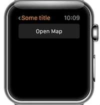

# WatchKit-Framer
Apple Watch Kit for FramerJS to help you easily create Apple Watch interfaces in Framer.

## Add it in your Framer Studio project

- Download the project from github.
- Copy `watchkit.coffee` into `modules/` folder.
- Import it in Framer Studio by writing: `WatchKit = require "watchkit"`.

**Note:** you need the San Francisco font [provided by Apple](https://developer.apple.com/watchkit/).

## Components

### Status Bar

Creates an Apple Watch status bar.


```coffeescript
statusBar = new WatchKit.StatusBar
	title: "Some title"
	back: true # Display or not the back button
	time: true # Display or not the time
```

### Buttons

Buttons should have the Y position where you want to place them in the screen.  
Buttons perform an animation when the user clicks them.

**Button for actions**


```coffeescript
actionButton = new WatchKit.ActionButton "Button title", y: 50
```

**Button for dismiss**


```coffeescript
dismissButton = new WatchKit.DismissButton y: 140
```

**Disable a button**

Buttons can be disabled using the `disabled: true`.


### Page

The basic page for the pagination element.  

```coffeescript
page = new WatchKit.Page
```

Layers can be added inside a page by using the `addLayer` method.

```coffeescript
page = new WatchKit.Page
layer = new Layer

page.addLayer layer
```
	
### Pagination

Creates a framer page component with the apple watch pagination dots.  
Pagination contains a set of pages.


```coffeescript
pagination = new WatchKit.Pagination
	showPagination: true # Display or not the pagination dots
```

In order to add pages use the `addPages` method.

```coffeescript
page1 = new WatchKit.Page image: "images/some_image.jpg"
page2 = new WatchKit.Page
someLayer = new Layer

page2.addLayer someLayer

pagination.addPages page1, page2
```

### Modal Sheet

Creates a modal sheet exactly with the same behaviour as the one in the watch.  
Use `present()` and `dismiss()` to show or hide the modal.



```coffeescript
modalSheet = new WatchKit.ModalSheet
	dismissTitle: "Dismiss" # Pass a dismiss title to enable a dismiss button
someLayer = new Layer

modalSheet.addLayer someLayer

modalSheet.present()
```

### Separator

Creates a default Apple separator. Specify the background color for a different color than the default one.


```coffeescript
separator = new WatchKit.Separator y: 100, backgroundColor: "blue"
```
